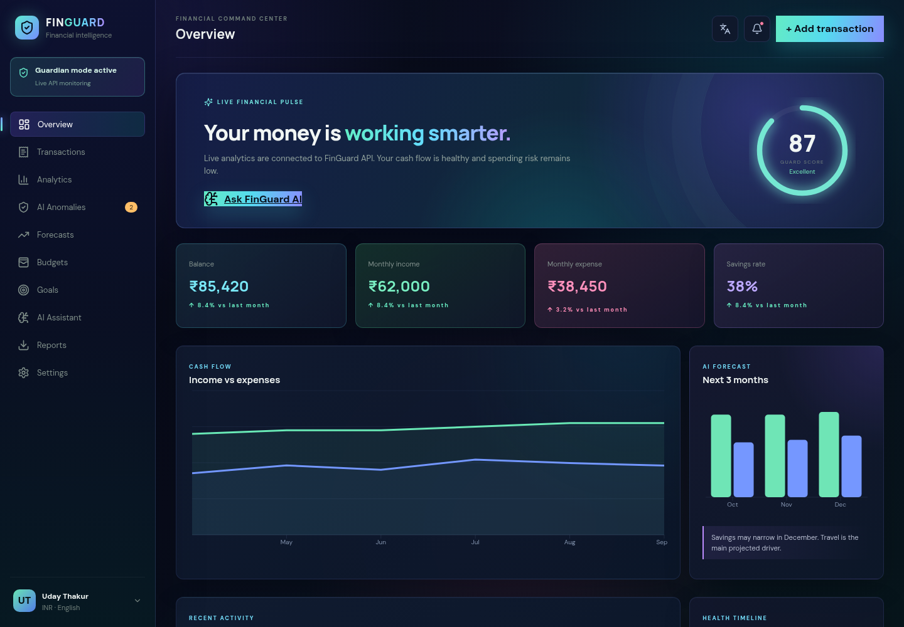

# FinGuard — Financial Anomaly & Expense Prediction Portal

<p align="center">
  <a href="https://ashu775-sanji.github.io/finguard-fullstack-color-zi/"><b>🚀 OPEN THE LIVE FINGUARD APPLICATION</b></a>
</p>

[](https://ashu775-sanji.github.io/finguard-fullstack-color-zi/)

> The GitHub repository displays source code and documentation. Click the launch link or dashboard preview above to open the working application.

A production-style full-stack fintech starter with React/TypeScript, FastAPI, PostgreSQL-ready SQLAlchemy, JWT authentication, anomaly detection, expense forecasting, budgets, goals, notifications and report endpoints.

## Demo login

- Email: `demo@finguard.app`
- Password: `FinGuard@2026`

New visitors can also create an account from the login screen.

## Quick start

```bash
cp backend/.env.example backend/.env
python -m venv .venv && source .venv/bin/activate
pip install -r backend/requirements.txt
uvicorn app.main:app --reload --app-dir backend
```

```bash
cd frontend && npm install && npm run dev
```

Open `http://localhost:5173`. The UI ships with realistic demo data; set `VITE_API_URL=http://localhost:8000/api/v1` to connect live APIs.

## Security baseline
- Argon2 password hashing, short-lived JWT access tokens, strict CORS allow-list
- Pydantic validation, ORM queries, ownership checks, trusted-host and security headers
- Secrets via environment only; PostgreSQL supported through `DATABASE_URL`
- Rate-limiting/revocation hooks are documented for Redis-backed production deployment

Run `pytest backend/tests` and `npm run build` before deployment.

## Gemini financial copilot

FinGuard AI is implemented server-side through FastAPI. It retrieves the authenticated user's transaction summary, category and merchant totals, budgets, goals, recent activity, and Guard Score before requesting a response from Gemini. The integration uses low-temperature grounded prompting, bounded conversation history, source labels, retry handling, a fallback Gemini model, and a deterministic financial fallback.

Set `GEMINI_API_KEY` in the backend environment. Never place it in the Vite frontend. A `render.yaml` blueprint is included for a free Render web service and PostgreSQL deployment.

## Financial scam protection and incident response

FinGuard now includes an authenticated Scam Analyzer, URL risk checks, a CSV Transaction Monitor with live demo simulation, Incident Center, Recovery Assistant, Evidence Vault with PDF export, Scam Education, safety-dashboard APIs, and Gemini chat grounded in recent scam analyses and incident records.

### Safety boundaries
- FinGuard does not recover money directly and does not impersonate any bank, payment provider, police force, government body, or authority.
- AI and model outputs are risk indicators, not definitive proof. Important information should be independently verified through official channels.
- Never submit passwords, PINs, CVVs, OTPs, private keys, or banking login credentials.
- Demonstration and public-dataset records are labeled and are not presented as live bank data.

See `docs/SAFETY_PLATFORM.md` for architecture, model training, datasets, security, and limitations.
